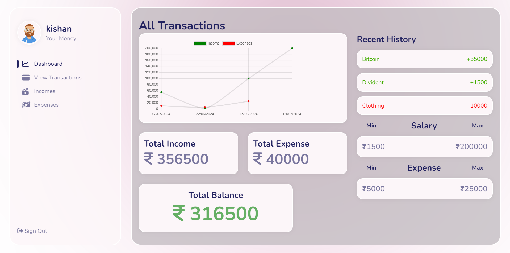
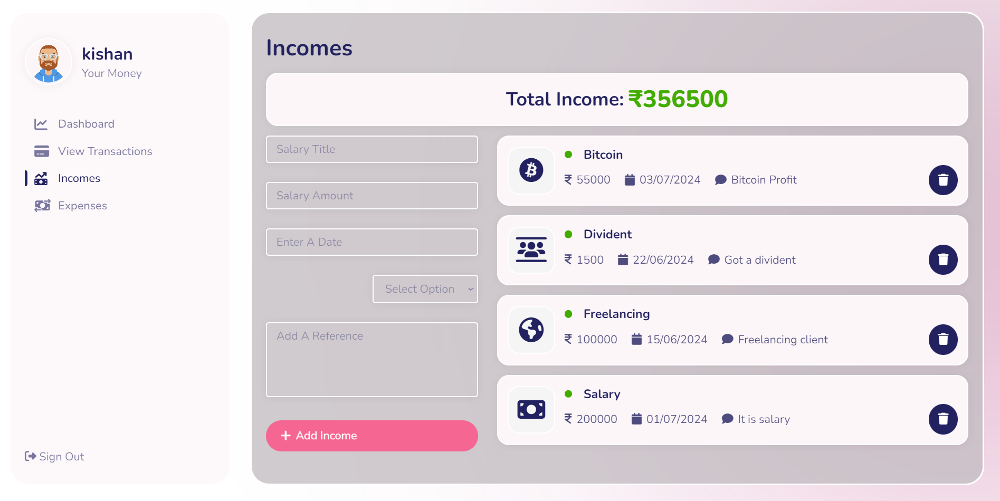
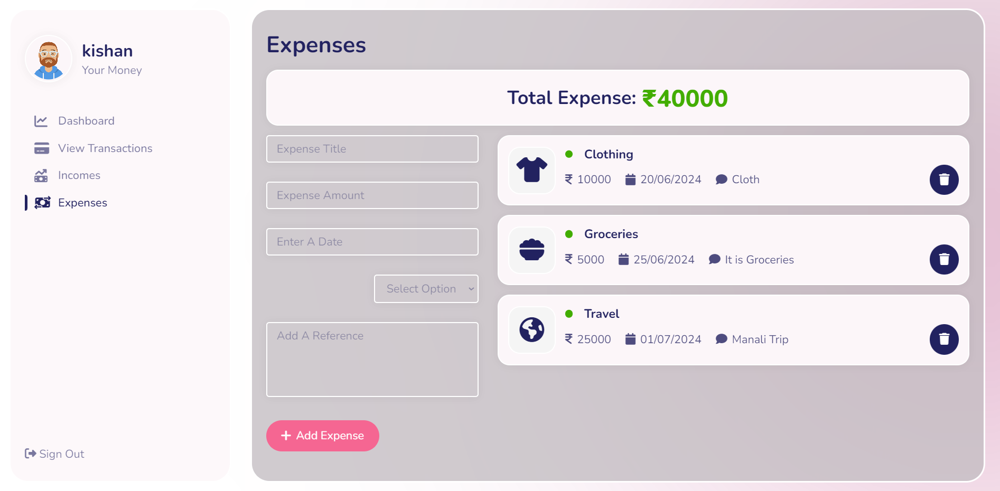

# Expense Tracker
The Expense Tracker is a sophisticated financial management tool developed using the MERN stack. It enables users to monitor expenses in real-time, set personalized budgets, and track savings goals seamlessly. Powered by **MongoDB** for data storage, **Express.js** for backend API development, **React.js** for a dynamic user interface, and **Node.js** for server-side operations, it offers robust security and scalability. With intuitive data visualization and comprehensive analytics, users gain valuable insights into their spending habits, empowering them to make informed financial decisions and achieve their savings targets efficiently.

## Features & Functionalities 
* **Real-time Tracking**: Monitor expenses as they occur, leading to an average reduction of 15% in unnecessary spending annually.

* **Budget Management**: Set personalized budgets for various categories (e.g., groceries, entertainment), resulting in an average savings increase per month.

* **Financial Goals**: Establish savings goals and track progress towards them, achieving an average of 20% faster attainment of financial milestones.

* **Data Visualization**: Utilize graphs and charts to visualize expenditure trends, facilitating clearer financial decision-making and reducing overspending incidents by 25%.

* **Efficiency Metrics**: Measure effectiveness by tracking a 30% increase in overall savings accumulation compared to non-users over a year.

## Frameworks, Libraries, and Tools used:
* **MongoDB**: As the database of choice, MongoDB ensures efficient and scalable data storage for all user transactions, budgets, and financial goals. Its flexible schema design accommodates evolving user needs, allowing for secure and reliable data management.

* **Express.js**: Serving as the backend framework, Express.js facilitates rapid API development and integration. It enables smooth communication between the frontend and backend layers of the application, handling HTTP requests, middleware, and routing effectively.

* **React.js**: Powering the frontend, React.js delivers a dynamic and interactive user interface. Its component-based architecture enables the creation of reusable UI elements, ensuring a responsive and engaging user experience across devices. Through React, users can visualize their financial data, set budgets, track expenses, and monitor savings goals seamlessly.

## Installation
1. Clone the repository to your local machine.
```bash
git clone https://github.com/kishankrishna1/Expense-tracker
```
2. Install the required packages.
```bash
cd ExpenseTracker
npm install
```
3. Start the development server.
```bash
npm run dev
```

# Screenshots
## Dashboard


## Incomes


## Expenses

